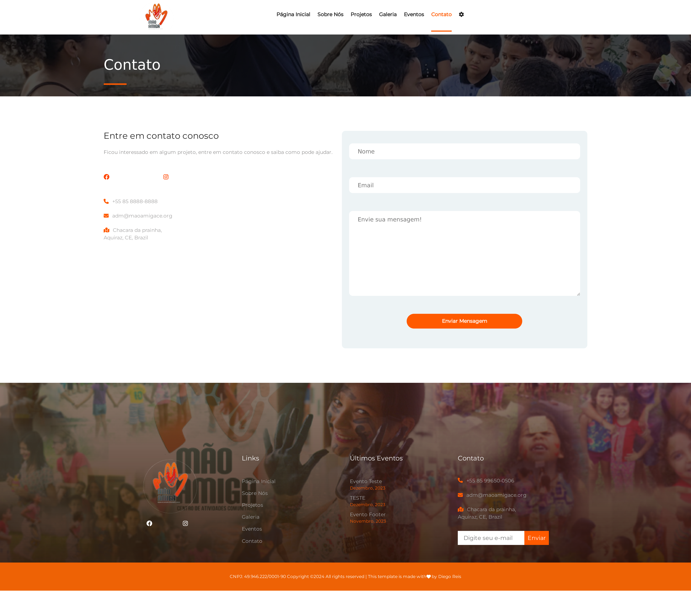
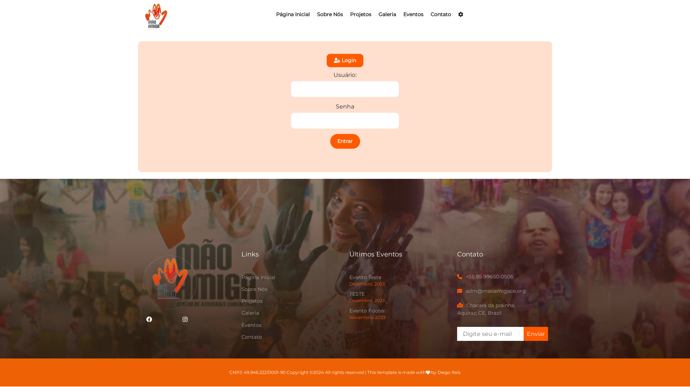
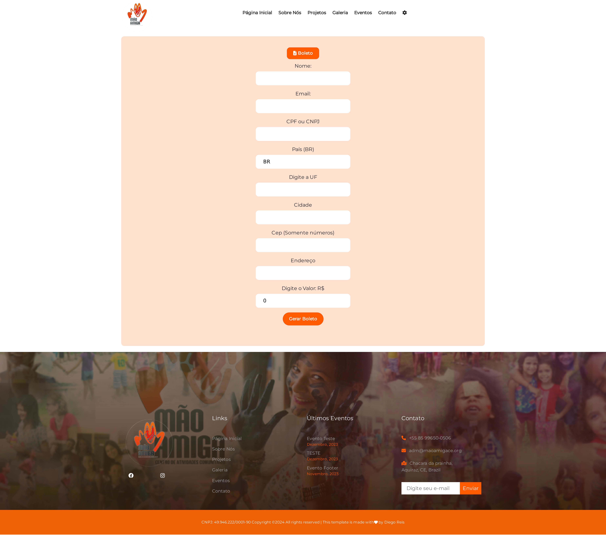
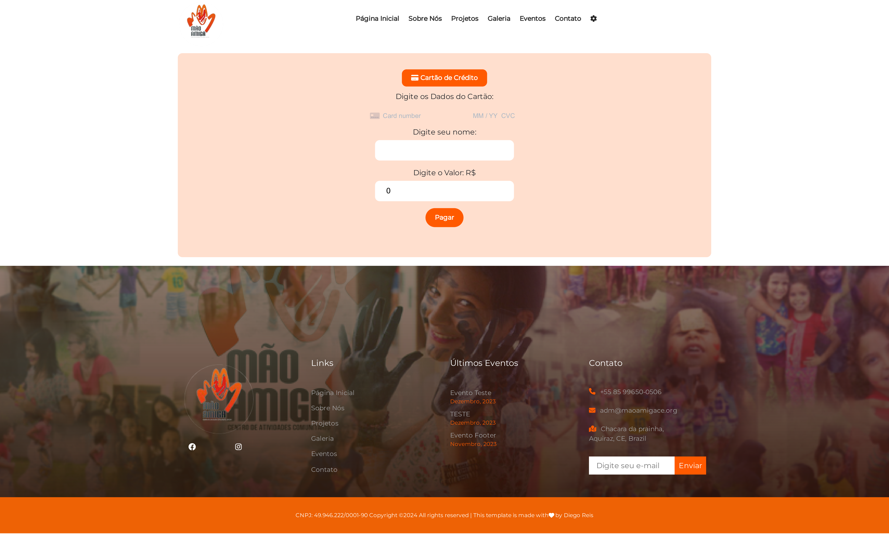

# Site Associação Mão Amiga.

📍 https://maoamigace.org/

Bem-vindo ao README do projeto Fullstack para o site da Associação Mão Amiga. Este projeto foi desenvolvido com React.js para frontend, Node.js e express para o Backend.

## 🔥 Introdução

Trata-se de um projeto voluntário, que conssistiu na criação do site da Associação Mão Amiga localizada no município de Aquiraz no Ceará.

# 💻Implementações do frontend:

- Costrução das seguintes páginas: Home, Sobre Nós, Projetos, Galeria, Eventos e Contato;

- Criação de slide dos cards e página inicial com a biblioteca swiper;

- Formulário para integração para pagamentos via stripe;

- Página de Login;

- Paineis administrativo para cadastrar: Eventos, Projetos e gestão da galeria de fotos;

- Integração para envio de e-mails de contato com a ferramenta SENDGRID.

- Deploy em ambiente de teste - Azure.

- Deploy em ambiente de Produção - Firebase.

# 🗃️ Implementações do Backend:

- Rota para Login;

- Rotas Painel administrativo, para cadastro do Eventos, Projetos e gestão da Galeria;

- Utilização do mongoose e MongoDb para gestão do banco de dados.

- Integração com API da Stripe, que possibilita a doação no próprio site, através de boleto e cartão de crédito;

- Rota para envio de e-mails com nodemailer;

- Deploy na plataforma Cyclic.

### ⚙️ Pré-requisitos

Certifique-se de ter o Node.js instalado em sua máquina antes de executar a aplicação.

```
Clone o repositório: git clone [URL do Repositório]
Instale as dependências: npm install
```

### 🔨 Guia de instalação

Para instalar e executar o projeto, siga as etapas abaixo:

1. Clone o repositório:

```
git clone [URL do Repositório]

```

2. Instale as dependências:

```
npm install

```

3. Inicie a aplicação:

```
npm start


```

## 📦 Tecnologias usadas:

**Frontend:**


**Backend:**


### 📚 Páginas do Site

- Página inicial  
  

- Sobre Nós
  

- Projetos
  

- Galeria
  

- Eventos
  

- Contato
  

- Login
  

- Página de Doações

#### - Boleto



#### - Cartão de Crédito



## 👷 Autores

- **Diego Reis** - _Desenvolvedor FullStack_

## 📄 Licença

Esse projeto está sob a licença (MIT LICENSE)

## 💡 Contato

- Para suporte, mande um email para dreis.dev@outlook.com.
- [](https://www.linkedin.com/in/dreis-dev/)
